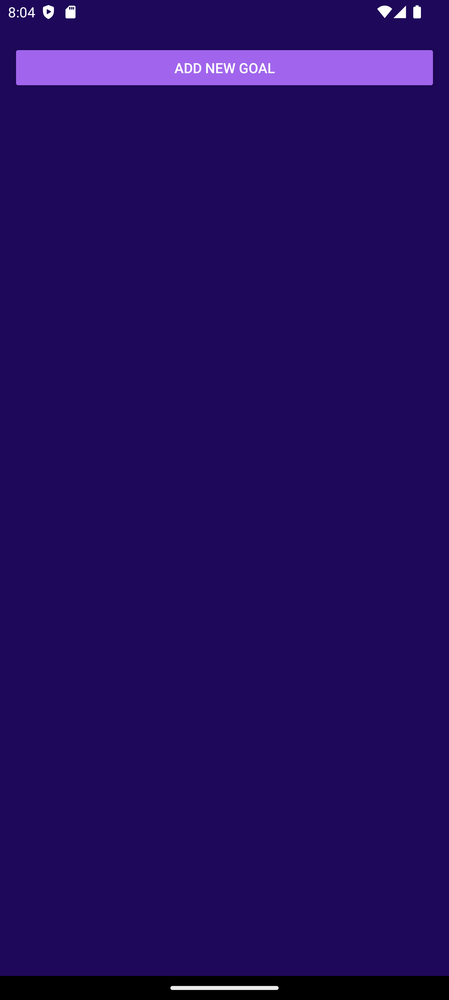
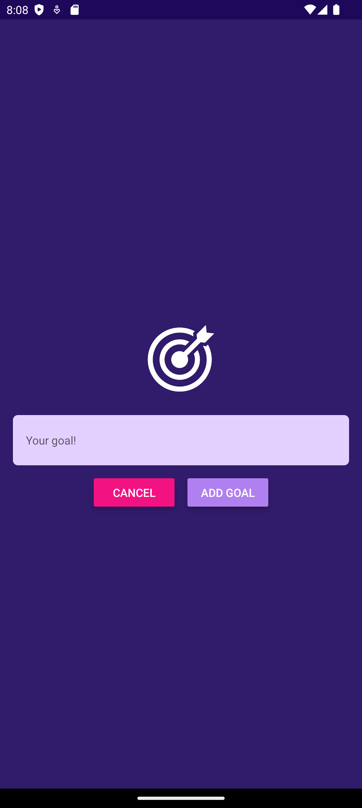

# React Native: Goals App by Tiago Gomes

A simple React Native app for managing your goals.

## Screenshots

## Installation

1. Clone the repository
2. Install the dependencies with `npm install`
3. Start the app with `expo start`

## Features

- Add goals
- Delete goals
- List goals
